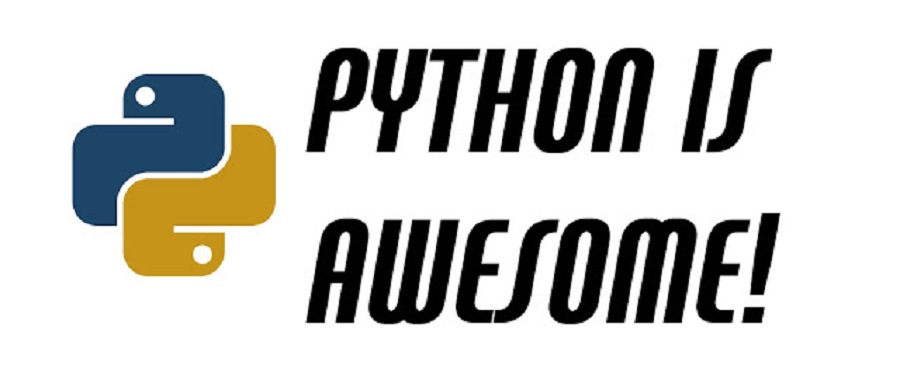

> Collect and classify Python open projects on GitHub

A similar Scala version is [here](http://itgeekworkhard.com/scala-github-projects/).

If you want to build a cool Python project from scratch, a good start point is to find a related project.  

This repository lists the hot (by number of stars) projects on GitHub. New projects are added gradually. The classification is based
on the project's main purpose. If a project is a client driver for a database, it is listed under the database category.

A project may belong to several categories. If you think that a project is listed under an incorrect category
or a new category should be added, please open an issue. If you want to add a new project to certain category, just
send me a pull request and follow the [contribution guide](https://github.com/checkcheckzz/Python-open-projects/wiki).

### <a name='toc'>Table of Contents</a>

* [AI](https://github.com/checkcheckzz/Python-open-projects/blob/master/AI.md)
* [Algorithm](https://github.com/checkcheckzz/Python-open-projects/blob/master/Algorithm.md)
* [Audio](https://github.com/checkcheckzz/Python-open-projects/blob/master/Audio.md)
* [Authentication](https://github.com/checkcheckzz/Python-open-projects/blob/master/Authentication.md)
* [Big Data and Cloud](https://github.com/checkcheckzz/Python-open-projects/blob/master/BigDataandCloud.md)
* [Book](https://github.com/checkcheckzz/Python-open-projects/blob/master/Book.md) 
* [Chat](https://github.com/checkcheckzz/Python-open-projects/blob/master/Chat.md) 
* [Command Line Tools](https://github.com/checkcheckzz/Python-open-projects/blob/master/CommandLineTools.md)
* [Concurrency](https://github.com/checkcheckzz/Python-open-projects/blob/master/Concurrency.md)
* [Content Management System](https://github.com/checkcheckzz/Python-open-projects/blob/master/ContentManagementSystem.md)   
* [Cool Application](https://github.com/checkcheckzz/Python-open-projects/blob/master/Cool%20Application.md)
* [DataBase and Related Tools](https://github.com/checkcheckzz/Python-open-projects/blob/master/DataBaseandRelatedTools.md)
* [Data Processing](https://github.com/checkcheckzz/Python-open-projects/blob/master/DataProcessing.md)
* [Debugging](https://github.com/checkcheckzz/Python-open-projects/blob/master/Debugging.md)
* [Devops](https://github.com/checkcheckzz/Python-open-projects/blob/master/Devops.md)
* [Editor and Editor Enhancements](https://github.com/checkcheckzz/Python-open-projects/blob/master/EditorandEditorEnhancements.md)
* [Game](https://github.com/checkcheckzz/Python-open-projects/blob/master/Game.md)
* [Git](https://github.com/checkcheckzz/Python-open-projects/blob/master/Git.md)
* [Icon](https://github.com/checkcheckzz/Python-open-projects/blob/master/Icon.md)
* [Image](https://github.com/checkcheckzz/Python-open-projects/blob/master/Image.md)
* [Job Scheduler](https://github.com/checkcheckzz/Python-open-projects/blob/master/JobScheduler.md)
* [Mail](https://github.com/checkcheckzz/Python-open-projects/blob/master/Mail.md)
* [Network and Related Tools](https://github.com/checkcheckzz/Python-open-projects/blob/master/Network.md)
* [Other](https://github.com/checkcheckzz/Python-open-projects/blob/master/Other.md)  
* [Package Manager](https://github.com/checkcheckzz/Python-open-projects/blob/master/PackageManager.md)
* [Science](https://github.com/checkcheckzz/Python-open-projects/blob/master/Science.md) 
* [Static Web Generator](https://github.com/checkcheckzz/Python-open-projects/blob/master/StaticWebGenerator.md)  
* [Testing](https://github.com/checkcheckzz/Python-open-projects/blob/master/Testing.md)
* [Tools and Utilities](https://github.com/checkcheckzz/Python-open-projects/blob/master/ToolandUtilities.md)
* [Tools for Web](https://github.com/checkcheckzz/Python-open-projects/blob/master/ToolsWeb.md)
* [Useful API](https://github.com/checkcheckzz/Python-open-projects/blob/master/UsefulAPI.md)
* [Video](https://github.com/checkcheckzz/Python-open-projects/blob/master/Video.md) 
* [Visualization](https://github.com/checkcheckzz/Python-open-projects/blob/master/Visualization.md) 
* [Web Framework and Related Tools](https://github.com/checkcheckzz/Python-open-projects/blob/master/WebFrameworkandRelatedTool.md)
* [Web Mining](https://github.com/checkcheckzz/Python-open-projects/blob/master/WebMining.md)
* [Web Site Source](https://github.com/checkcheckzz/Python-open-projects/blob/master/WebSiteSource.md)

### License

Python-github-projects is licensed under the [CC-By 3.0 License](http://creativecommons.org/licenses/by/3.0/).

